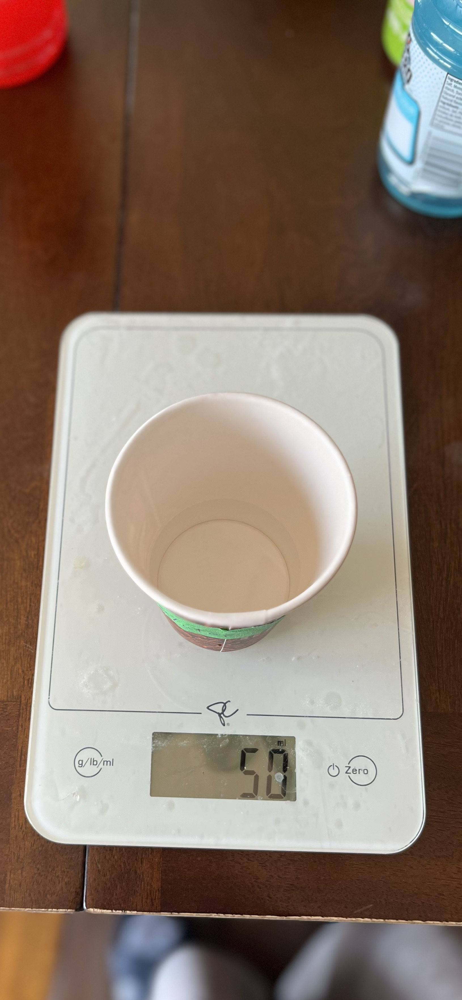
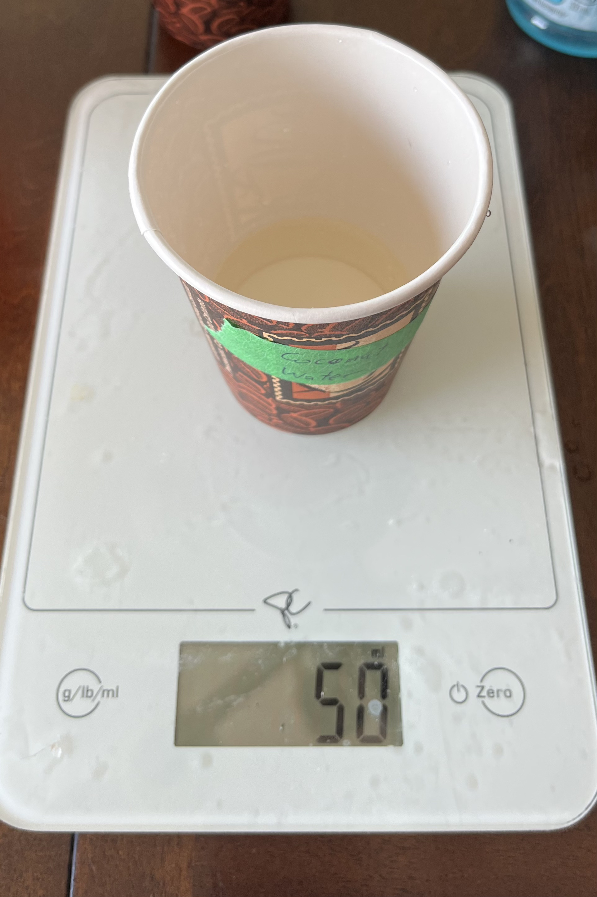
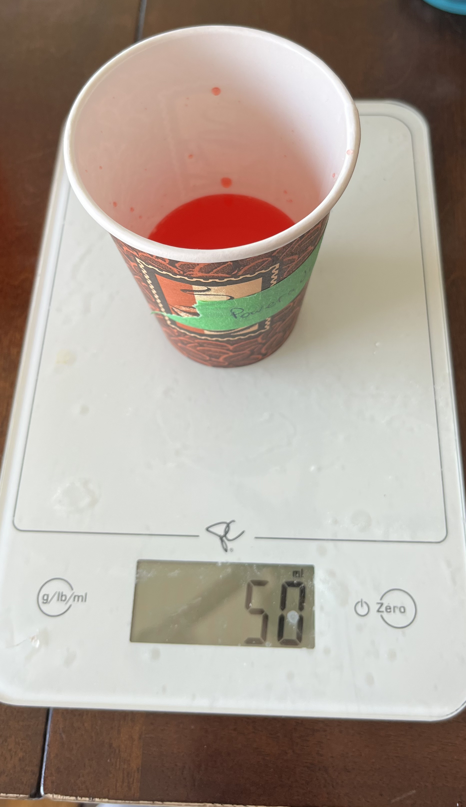
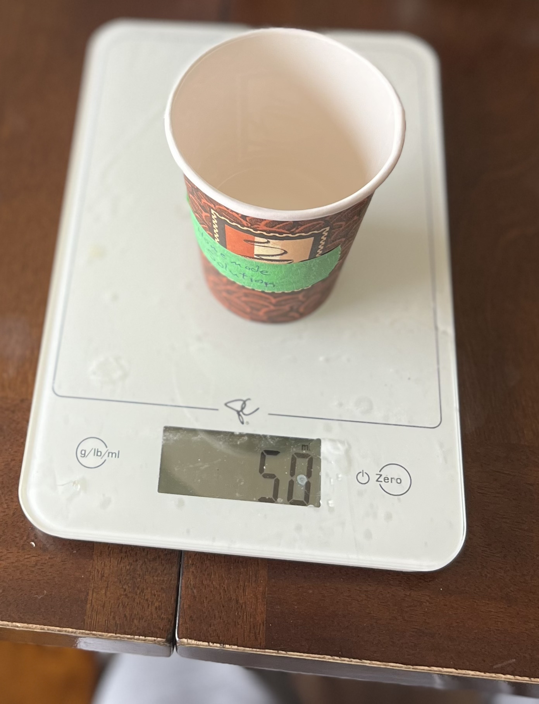
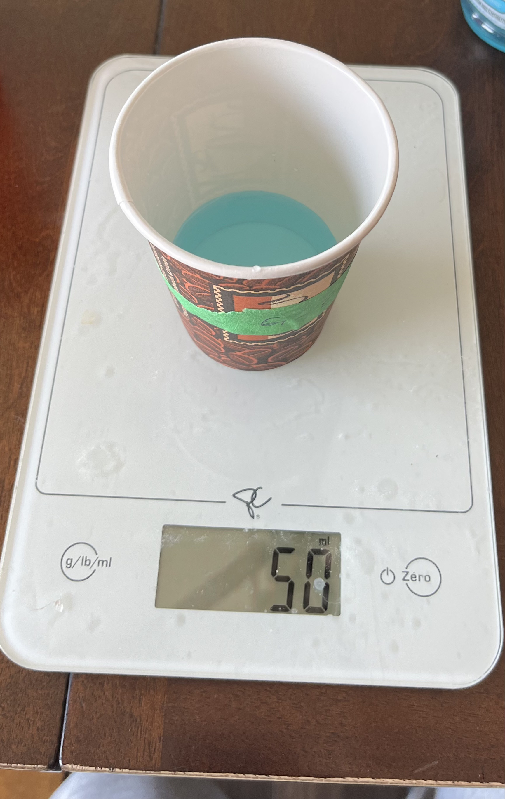

## Drinks Tested

| Drink                         | Role                                 |
| ----------------------------- | ------------------------------------ |
| Plain water                   | Control (baseline — no electrolytes) |
| Coconut water                 | Natural electrolyte drink            |
| Powerade                      | Commercial sports drink              |
| Homemade electrolyte solution | Water + Table Salt Solution          |
| Gatorade                      | Commercial sports drink              |

<p align="center">
  
  
  
  
  
</p>

### Homemade Solution Recipe

| Ingredient  | Amount        | Purpose                   |
| ----------- | ------------- | ------------------------- |
| Water       | 2 cups        | Base solvent              |
| Table salt  | ¼ tsp         | Provides Na⁺ and Cl⁻ ions |
| Lemon juice | Small squeeze | Adds potassium (K⁺)       |

<p align="center">
  
</p>

---

## Equipment

- SNAP circuits kit (battery holder + LED + wires)
- 5 small plastic cups
- Paper towels (to dry probes between tests)
- Tape and pen (for labeling cups)
- iPhone 13 (for photographing LED brightness)
- Aforementioned drinks

---

## Conductivity Tester Design

The tester works as a simple series circuit:

```
[Battery] → [LED] → [Wire A] → [Liquid] → [Wire B] → back to battery
```

When the two probes are dipped into a conductive liquid, the circuit is completed and the LED lights up. The brighter the light, the more ions are present in the liquid.

> **Why this works:** Ions in solution carry the electrical current between the two probes, just like a wire would — but only if there are enough charged particles present.

---

[[Procedure|Next: Procedure →]]
